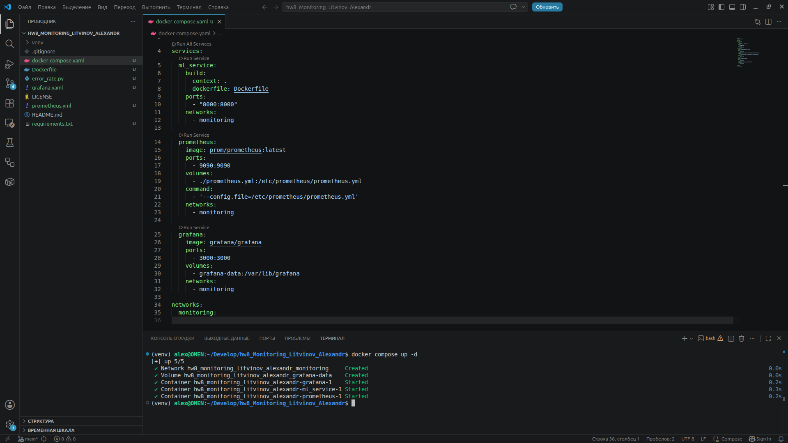
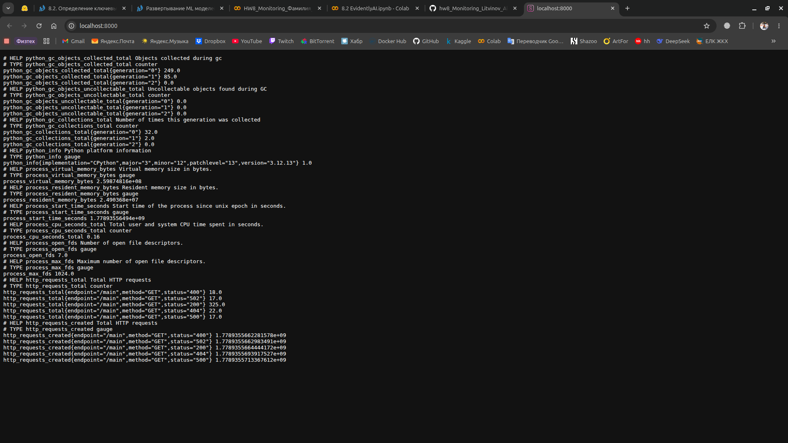
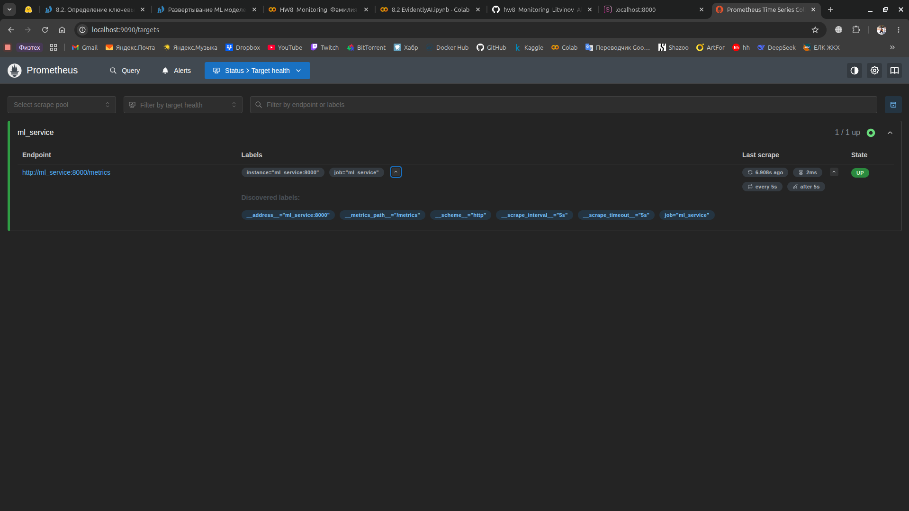
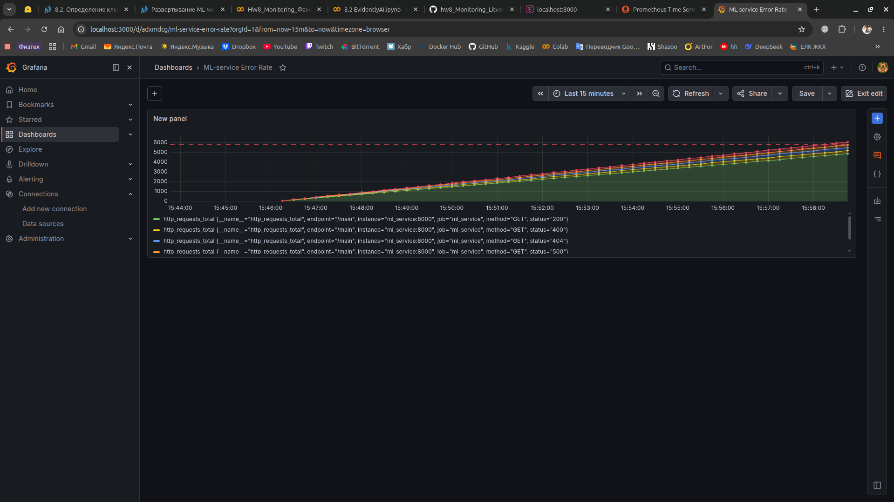
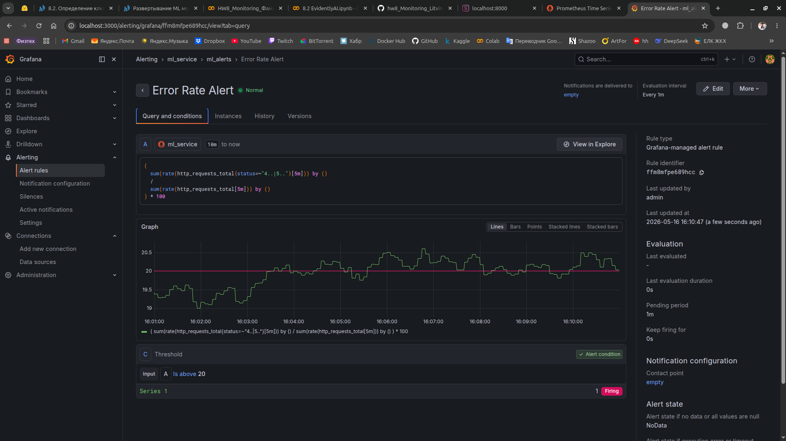
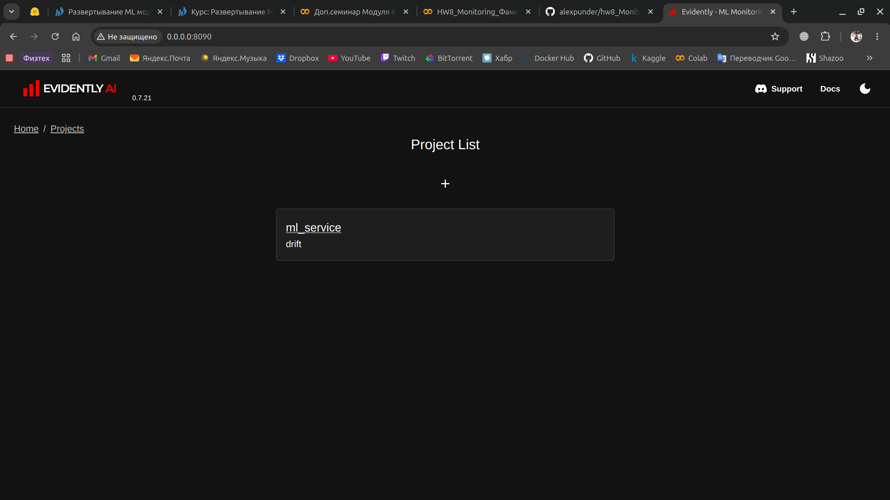
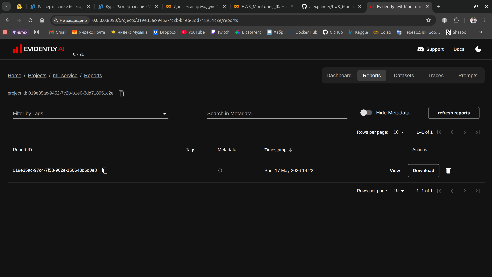
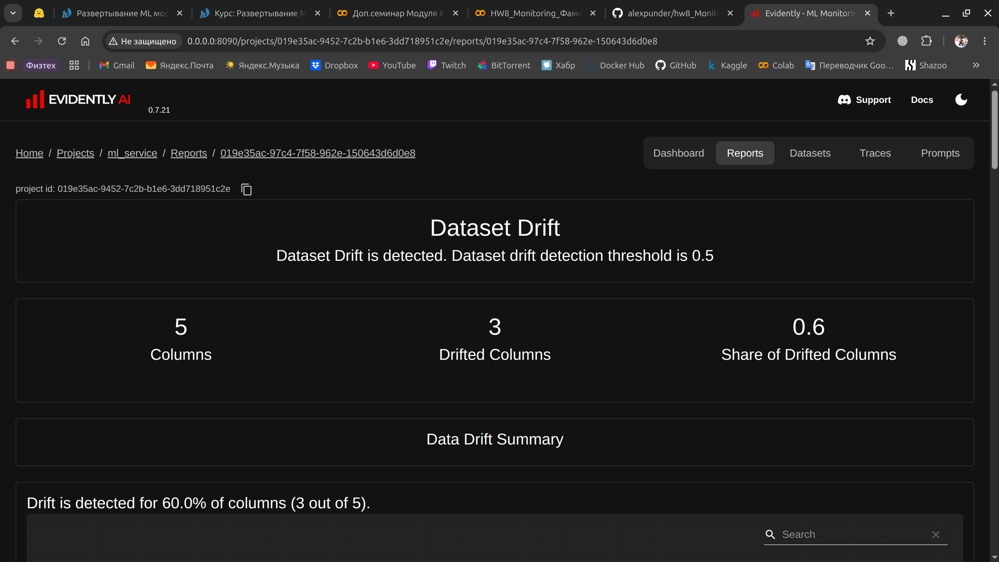
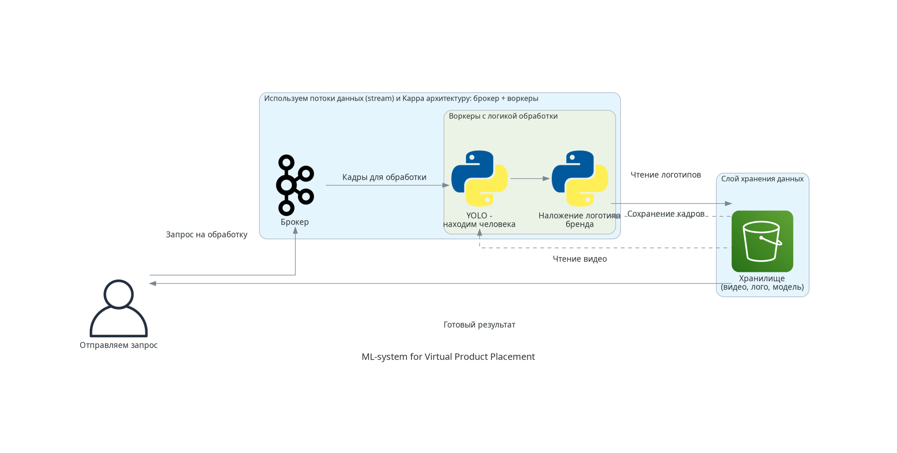

# Домашнее задание 8. Мониторинг

### 1. Определить ключевые бизнес- и технические метрики для ML-системы

Метрики бизнеса: `CTR` перехода на рекомендации и `Churn Rate` после внедрения модели, `Conversion Rate` в приобритение подписки (если такая услуга есть), `Среднее время просмотра`;

Метрики приложения: `Latency p95 < 100ms` задержка по 95% перцентилю, `Error Rate < 0.1%` доля неудачных запросов, ошибок со статусом 4** и 5**;

ML-метрики: `Precision@k / Recall@k / F1-score` (сбалансированность между полнотой и точностью), `NDCG`, `Mean Average Precision` и `Top-K Accuracy` для рекомендаций;

Метрики инфраструктуры: `Resource Usage` - использование CPU / RAM, `Availability 99.9%` доступность сервиса (100% практически недостижимо), `Throughput` для базы данных;

### 2. Настроить мониторинг с использованием Prometheus, Grafana, MLflow

- [Ссылка на docker compose с инфраструктурой](docker-compose.yaml)
- [Ссылка на prometheus.yaml](prometheus.yml)
- [Ссылка на код для демонстрации метрики Error Rate](error_rate.py)

[Ссылка на .json итогового дашборда](dashboard-1779008257822.json)

Для наглядности, в коде стоит вероятность ошибки `0.2`, граница мониторинга соответствует этому значению (`20%`), а не выбранному порогу из задания 1 в `0.1%`.

### 3. Обнаружить деградацию модели и дрифт

[Ссылка на исполняемый код](model_drift.py)

  

### 4. Обеспечить качество данных с Data Quality Ops

Задание не выполнено.

### 5. Разработать схему ML-системы для Virtual Product Placement

[Код Diagrams реализован здесь](vpp.py)

